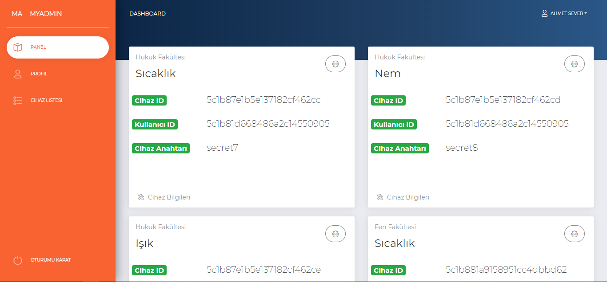
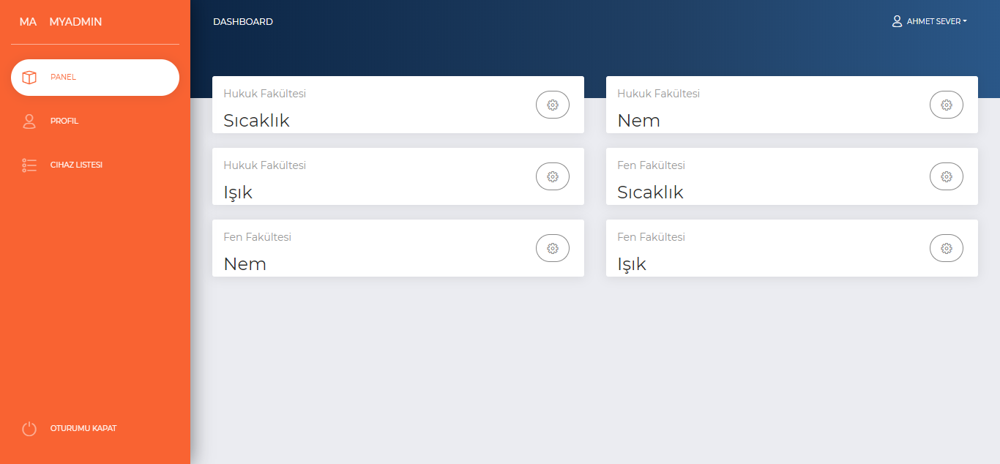
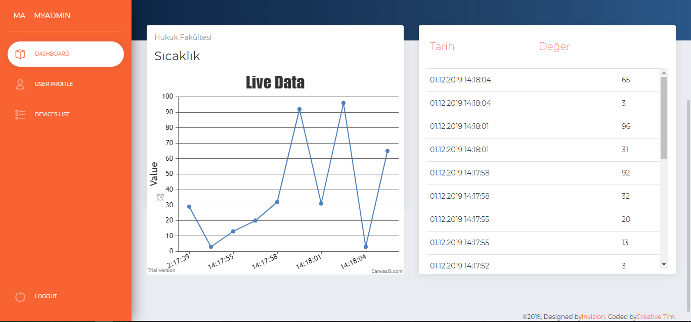
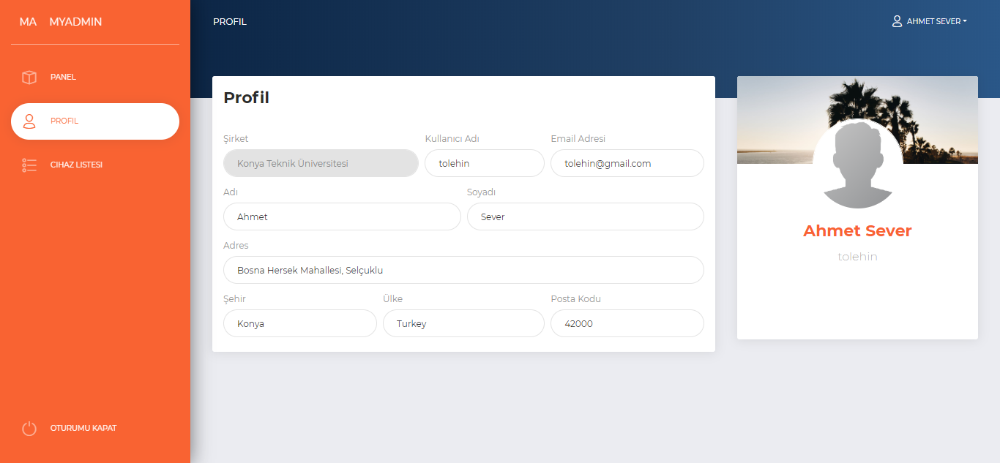
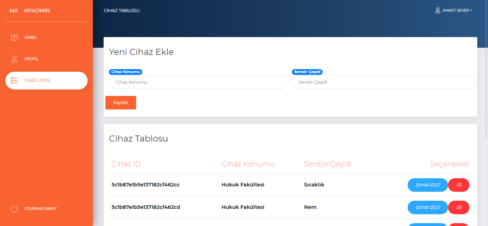

# IoT
IoT cihazlarından gelen verilerin websocketler ile canlı olarak izlenmesi.

Projenin klonunu indirdikten sonra npm install komunutu çalıştırmak gerekiyor.

Proje ile ilgili ekran görüntüleri:

Dashboard ekranı:

Verileri izleme ekranı:

Kullanıcı profil ekranı:

Yeni cihaz ekleme ve mevcut cihazlar ekranı:

